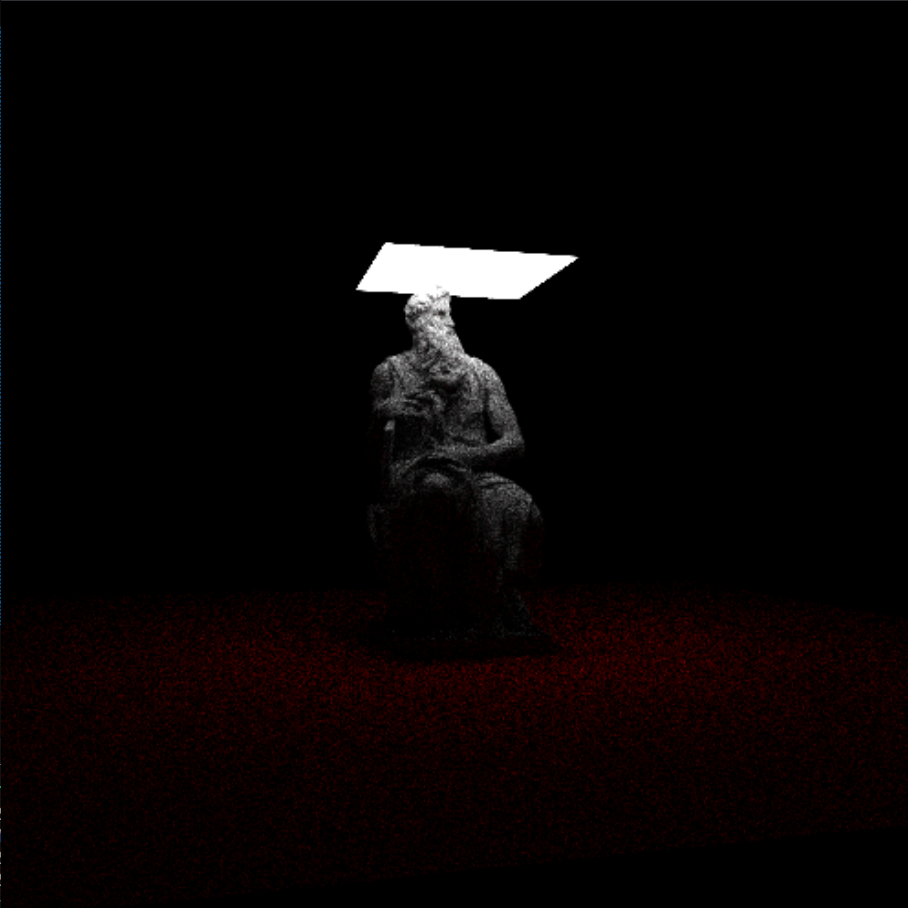
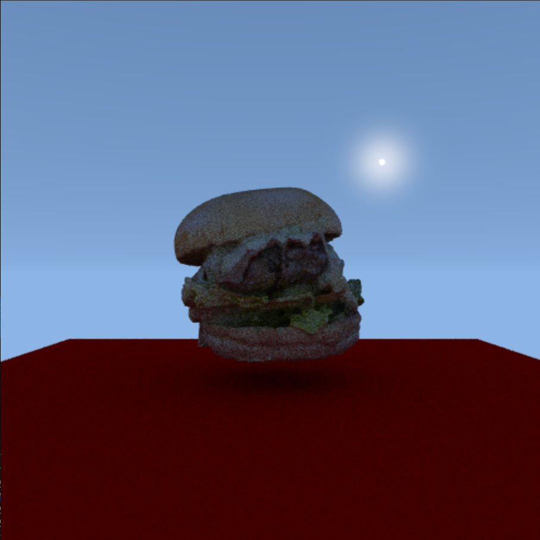
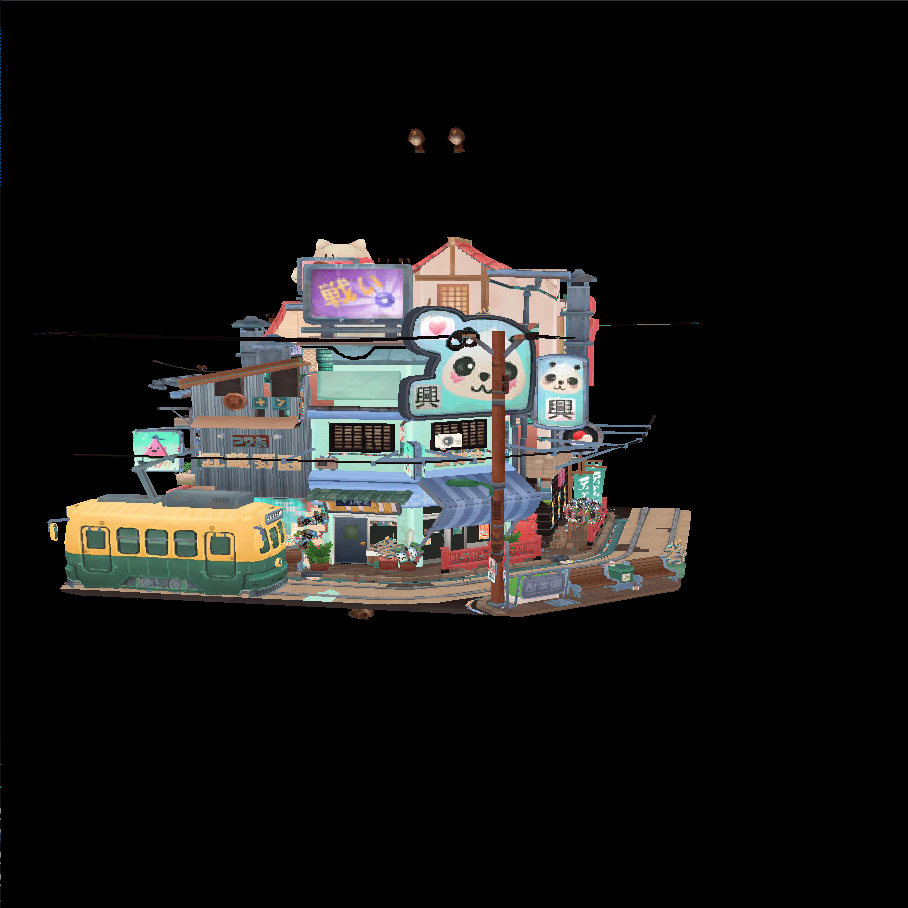
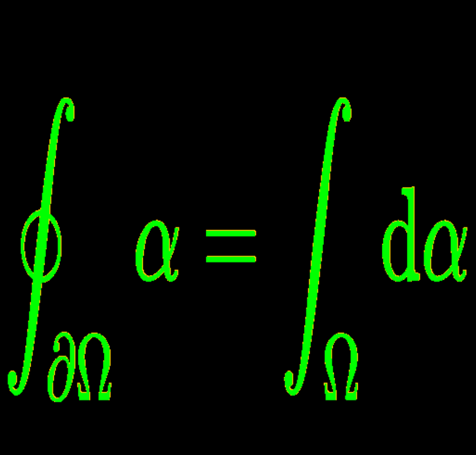

# tela-render

Testing some renders of meshes and svg using tela.js

## Install

```bash
npm install
```
or
```bash
bun install
```

## Run

```bash
npx http-server
```

or
```bash
bunx http-server
```

Then open `http://localhost:8080` in your browser.

## Images




